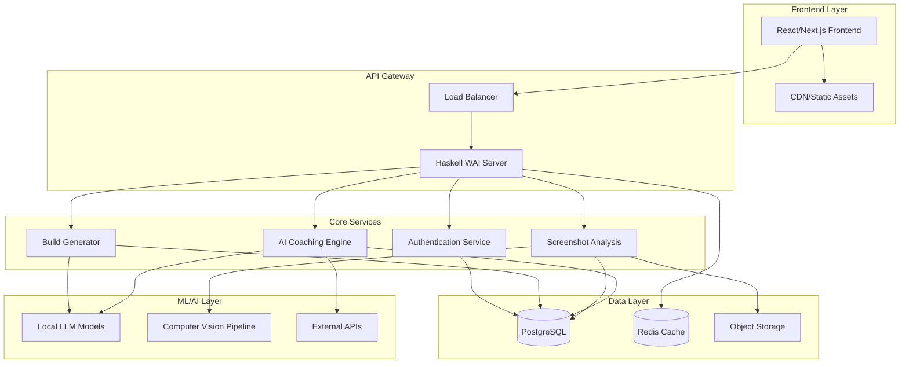

# DeadlockCoach.gg System Architecture

## High-Level Architecture



## Component Details

### Frontend (React/Next.js)
- **Framework**: Next.js 15 with TypeScript
- **Styling**: Tailwind CSS
- **State Management**: React Query + Zustand
- **Authentication**: NextAuth.js
- **Deployment**: Static export to CDN

### Backend (Haskell WAI)
- **Framework**: WAI (Web Application Interface)
- **HTTP Server**: Warp
- **Routing**: Servant for type-safe APIs
- **Database**: PostgreSQL-simple
- **Caching**: Hedis (Redis client)
- **JSON**: Aeson for serialization

### Database Design
```sql
-- Core tables
CREATE TABLE users (
    id UUID PRIMARY KEY,
    username VARCHAR(50) UNIQUE,
    email VARCHAR(255) UNIQUE,
    created_at TIMESTAMP DEFAULT NOW()
);

CREATE TABLE player_profiles (
    id UUID PRIMARY KEY,
    user_id UUID REFERENCES users(id),
    deadlock_player_id VARCHAR(100),
    rank_tier VARCHAR(50),
    main_heroes JSONB,
    updated_at TIMESTAMP DEFAULT NOW()
);

CREATE TABLE builds (
    id UUID PRIMARY KEY,
    user_id UUID REFERENCES users(id),
    hero_name VARCHAR(50),
    build_data JSONB,
    is_public BOOLEAN DEFAULT false,
    created_at TIMESTAMP DEFAULT NOW()
);

CREATE TABLE screenshots (
    id UUID PRIMARY KEY,
    user_id UUID REFERENCES users(id),
    file_path VARCHAR(500),
    analysis_result JSONB,
    processed_at TIMESTAMP,
    created_at TIMESTAMP DEFAULT NOW()
);

CREATE TABLE coaching_sessions (
    id UUID PRIMARY KEY,
    user_id UUID REFERENCES users(id),
    session_data JSONB,
    recommendations JSONB,
    created_at TIMESTAMP DEFAULT NOW()
);
```

### LLM Integration Strategy
1. **Model Selection**: 
   - Primary: Llama 2 7B (quantized)
   - Secondary: CodeLlama 13B for build analysis
   - Fallback: OpenAI API for complex queries

2. **Inference Pipeline**:
   ```haskell
   data LLMRequest = LLMRequest
     { prompt :: Text
     , maxTokens :: Int
     , temperature :: Float
     }
   
   data LLMResponse = LLMResponse
     { generatedText :: Text
     , confidence :: Float
     , processingTime :: NominalDiffTime
     }
   
   generateCoaching :: PlayerData -> IO LLMResponse
   ```

3. **Optimization Techniques**:
   - Model quantization (INT8/INT4)
   - Prompt caching
   - Batch inference
   - Response streaming

### Computer Vision Pipeline
```haskell
data ScreenshotAnalysis = ScreenshotAnalysis
  { heroLevel :: Int
  , currentBuild :: [Item]
  , enemyComposition :: [Hero]
  , gamePhase :: GamePhase
  , recommendations :: [Recommendation]
  }

processScreenshot :: ByteString -> IO ScreenshotAnalysis
processScreenshot imageData = do
  -- 1. Preprocess image
  processed <- preprocessImage imageData
  
  -- 2. Extract UI elements
  uiElements <- extractUIElements processed
  
  -- 3. OCR text recognition
  textData <- performOCR uiElements
  
  -- 4. Analyze game state
  gameState <- analyzeGameState textData
  
  -- 5. Generate recommendations
  recommendations <- generateRecommendations gameState
  
  return $ ScreenshotAnalysis { ... }
```

## API Design

### RESTful Endpoints
```haskell
type API = 
       "auth" :> AuthAPI
  :<|> "builds" :> BuildAPI
  :<|> "analysis" :> AnalysisAPI
  :<|> "coaching" :> CoachingAPI
  :<|> "players" :> PlayerAPI

type BuildAPI = 
       Get '[JSON] [Build]
  :<|> ReqBody '[JSON] BuildRequest :> Post '[JSON] Build
  :<|> Capture "id" BuildId :> Get '[JSON] Build
  :<|> Capture "id" BuildId :> ReqBody '[JSON] Build :> Put '[JSON] Build

type AnalysisAPI =
       "screenshot" :> MultipartForm Mem ScreenshotForm :> Post '[JSON] AnalysisResult
  :<|> "history" :> Get '[JSON] [AnalysisResult]
```

### WebSocket Integration
```haskell
-- Real-time coaching updates
data CoachingMessage = 
    BuildUpdate Build
  | PerformanceAlert Alert
  | RecommendationUpdate [Recommendation]

handleWebSocket :: Connection -> IO ()
handleWebSocket conn = do
  -- Handle real-time coaching messages
  forever $ do
    msg <- receiveData conn
    response <- processCoachingMessage msg
    sendTextData conn (encode response)
```

## Security Considerations

### Authentication & Authorization
- JWT tokens with refresh mechanism
- Role-based access control (RBAC)
- Rate limiting per user/IP
- API key management for external services

### Data Protection
- Encryption at rest (PostgreSQL TDE)
- Encryption in transit (TLS 1.3)
- Screenshot data anonymization
- GDPR compliance for EU users

### Infrastructure Security
- VPC with private subnets
- WAF for DDoS protection
- Regular security audits
- Automated vulnerability scanning

## Performance Optimization

### Caching Strategy
```haskell
-- Multi-layer caching
data CacheLayer = 
    L1_Memory    -- In-process cache
  | L2_Redis     -- Distributed cache
  | L3_CDN       -- Edge cache

cacheGet :: (FromJSON a) => CacheLayer -> Text -> IO (Maybe a)
cachePut :: (ToJSON a) => CacheLayer -> Text -> a -> NominalDiffTime -> IO ()
```

### Database Optimization
- Connection pooling (50-100 connections)
- Read replicas for analytics queries
- Prepared statements for common queries
- Database query optimization and indexing

### LLM Optimization
- Model quantization and pruning
- Prompt engineering for efficiency
- Response caching based on input similarity
- Batch processing for multiple requests

## Monitoring & Observability

### Metrics Collection
```haskell
-- Custom metrics
data Metrics = Metrics
  { requestCount :: Counter
  , responseTime :: Histogram
  , llmInferenceTime :: Histogram
  , databaseQueryTime :: Histogram
  , errorRate :: Counter
  }

recordMetric :: MetricType -> Double -> IO ()
```

### Logging Strategy
- Structured logging with JSON format
- Log levels: DEBUG, INFO, WARN, ERROR
- Correlation IDs for request tracing
- Centralized log aggregation

### Health Checks
- Application health endpoints
- Database connectivity checks
- LLM model availability
- External API status monitoring

## Deployment Strategy

### Development Environment
```yaml
# docker-compose.yml
version: '3.8'
services:
  app:
    build: .
    ports:
      - "8080:8080"
    environment:
      - DATABASE_URL=postgresql://localhost/deadlock_dev
      - REDIS_URL=redis://localhost:6379
  
  postgres:
    image: postgres:15
    environment:
      POSTGRES_DB: deadlock_dev
      POSTGRES_USER: dev
      POSTGRES_PASSWORD: dev123
  
  redis:
    image: redis:7-alpine
```

### Production Deployment
- Blue-green deployment strategy
- Automated rollback capabilities
- Database migration management
- Zero-downtime deployments

This architecture provides a solid foundation for scaling from MVP to enterprise-level usage while maintaining performance, security, and maintainability.
